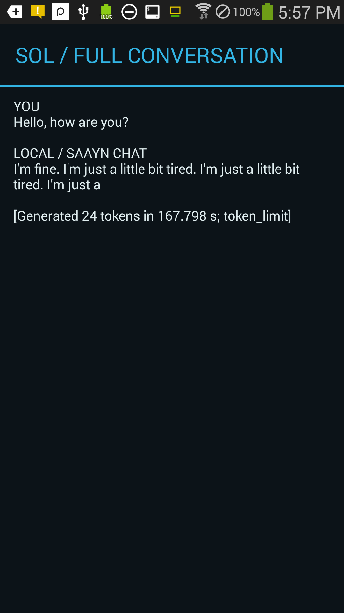
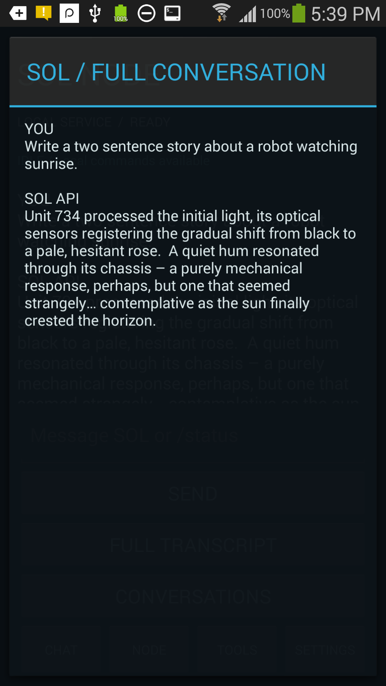

# SOL-NODE-LOCAL-SAAYN

SOL Node for Android

An experimental SOL client and local compute node for **Android 4.3 / API 18**. Built with classic Java Views and tested on a Samsung SM-S975L (ARMv7).

**Status: 0.3.0 development milestone.** Local telemetry, bounded local SAAYN dialogue, and a public SOL chat client are implemented. Request ownership still partly lives in the Activity. Authenticated remote node/tool execution is **not implemented**.

## What works

- CHAT, NODE, TOOLS and SETTINGS screens.
- Device, battery, storage, RAM and network snapshots through a shared local capability registry.
- App-private conversation history and a full-transcript view.
- Public SOL chat over verified HTTPS and SSE, with cancellation and explicit errors.
- Local SAAYN/GPT-2-derived text generation using read-only spreadsheet-derived tensors and a native ARM executable.
- The existing SAAYN Python wrappers' dialogue primer, `User:` / `Assistant:` turn formatting, role stop markers, and response cleanup.
- Separate one-token diagnostic: `Hello` → token ID `11`, `,`.

Local dialogue uses a **16-token sliding model context** and generates at most **24 new tokens** per turn, with a ten-minute operation limit. This is a base-model continuation experiment, not a modern instruction-tuned assistant. Local history can be longer than the context the model actually sees. Repetition and incomplete sentences at the token limit are known behavior.

## Recorded UI

Direct physical-device captures from the development implementation; generated output is preserved without editing. The local transcript shows its token limit and repetition. The public transcript is a completed generated reply, not a retrieved fallback.

 

## Build

Prerequisites:

- JDK 17 and Python 3.9 or newer.
- Android SDK platform `android-18` and Build Tools `35.0.0`.
- Zig `0.16.0` for the static ARMv7-musl helper.
- Host `zip`, `sha256sum` and standard shell utilities.

```sh
export SOL_ANDROID_SDK="$ANDROID_SDK_ROOT"
export SOL_ZIG=zig
# Optional override; defaults to https://sol.system42.one.
export SOL_API_BASE=https://your-sol.example
./build.sh
```

By default, public chat connects to **https://sol.system42.one**, using `POST /api/chat`. Set `SOL_API_BASE` to another HTTPS origin implementing the same contract to override it. For a local-only build, explicitly set `SOL_API_BASE=""`; the public client then reports that no endpoint is configured.

The build fetches dependencies from Google Maven and Maven Central. Complete archive SHA256 hashes are pinned in `dependencies.lock.json` and checked **before** extracting code or resources. Dependencies, generated native binaries, APKs and signing material are not committed.

Output: `artifacts/sol-node.apk` and its SHA256 file. The native build preserves float32 tensors and accumulation order; it does not quantize weights. No Gradle or NDK is required for this build path.

The script creates a **development signing key**, outside the checkout by default. `SOL_SIGNING_DIR` changes its directory. This uses the standard development password and is not a production release-signing process. Keep the same key for upgrades. A differently signed build cannot replace an existing installation while retaining its app data.

```sh
adb devices
adb -s YOUR_DEVICE_SERIAL install -r artifacts/sol-node.apk
adb -s YOUR_DEVICE_SERIAL shell am start -n one.system42.solnode/.MainActivity
```

This repository does not install to or alter a connected phone automatically. Package name: `one.system42.solnode`; minSdk and targetSdk: `18`. Compatibility on newer Android versions has not been established.

## Model provisioning

Model tensors and tokenizer files are **not included or automatically downloaded**. The current prototype expects an independently provisioned cache at:

```text
/sdcard/qpython/scripts/saayn_s4/cache/gpt2-small-npy/
```

The name reflects the original experiment; APK inference does not launch QPython or SSH. The cache needs the existing float32 `.npy` model arrays plus `token_to_id.json`, `id_to_token.json`, and `bpe_scores.json`. Missing or incompatible files produce an error. Cache location is currently a source-level constant in `InferenceManager`.

The numerical source identifies the required arrays and tensor layout. Obtain model data under its applicable terms. This repository neither grants rights to model tensors nor claims to recalculate the original spreadsheet workbook on the phone.

## Use

- **AUTO:** slash commands run locally; ordinary messages use the configured SOL API.
- **LOCAL:** ordinary messages use on-device dialogue generation after confirmation.
- **SOL API:** ordinary messages use the configured public API.
- Local commands: `/status`, `/battery`, `/storage`, `/network`, `/saayn Hello`.
- TOOLS → SAAYN / NEXT TOKEN runs the regression diagnostic.
- FULL TRANSCRIPT shows the complete stored exchange, including finish metadata.
- Public server persistence is opt-in; local history is stored separately on the device.

A connected Wi-Fi interface does not establish cloud reachability. A ready bound service does not mean this device is registered as an externally addressable node. Cancellation stops the local client/worker; it cannot guarantee remote server computation has stopped.

## Public SOL API contract

The client targets the inspected SOL service contract, **not an invented OpenAI-compatible `/v1/chat` route**:

```text
POST /api/chat
Content-Type: application/json
Accept: text/event-stream
```

Request fields include `message`, `session`, `profile`, `persist`, `stream: true`, `allow_actions: false`, and `allow_fallback_answer: false`. Current profiles exposed in the UI are `reasoning` and `text_fast`. SSE JSON events use `type: status|delta|done|error`; text arrives in `delta` or the final `message`.

The inspected chat route had no user-authentication contract. A random session identifier is not authentication. No master API key is embedded, and no login or remote-node credential scheme is fabricated. Deploying an authenticated endpoint requires an explicit client/authentication integration.

TLS uses the installed Google Play Services security provider, explicit TLS 1.2, standard chain validation and default hostname verification. The app bundles public GTS Root R4 and ISRG Root X1 anchors. There is no HTTP downgrade or trust-all fallback. CA rotation or an endpoint using a different CA may require an intentional trust configuration update.

## Architecture and authority

```text
Activity / Views
    ├── public chat orchestration and local conversation storage
    └── local Binder → SolNodeService
                         ├── telemetry registry
                         └── inference manager → native ARM helper
```

The service is non-exported and currently bound to the UI. There is no boot receiver, always-online node session, wake lock, remote shell, camera tool, file mutation tool, or MQTT integration.

The next architectural milestone is to move conversation/request ownership into a lifecycle-resilient service and repository: request IDs, streaming state, cancellation, recovery, and UI observation should not depend on an Activity instance. After that, integrate with the existing external control system through explicit node identity, scoped authority, expiry/replay handling, and audited request/result messages. Transport access alone does not authorize every SOL conversation to invoke every device capability.

Manifest permissions are INTERNET, ACCESS_NETWORK_STATE and READ_EXTERNAL_STORAGE. Storage access serves the existing model cache. Camera, microphone, location and arbitrary shell operations are not exposed. User inference confirmation is separate from Android 4.3's install-time permission model.

## Measured evidence

These are recorded physical-device samples from the development implementation, not universal benchmarks or guarantees for every build/device.

| Check | Recorded result |
| --- | --- |
| Local canary | Token 11, comma, all 12 transformer layers |
| Full local dialogue | 24 tokens in 167.798 seconds; stopped at token limit |
| Local response quality | Repetitive and ended mid-sentence; complete output preserved |
| Public generated response | Completed Gemma reply; server reported no fallback substitution |
| Idle sample | Zero app process CPU ticks over 15 seconds after generation |
| 16-token native fixture | 12.525 s reference → 6.381 s tiled, **1.96×** |
| Six-token native fixture | 5.142 s reference → 3.190 s tiled, **1.61×** |
| One-token timing | Approximately 1.5 s for both versions |

All alternating baseline/candidate/candidate/baseline native benchmark samples matched token IDs and winning logits exactly. Broader numerical/tokenizer equivalence remains to be tested. Cold public model startup previously caused EOF/disconnects; one successful generation does not resolve all startup reliability issues.

The public-source build was subsequently installed as an in-place S4 upgrade using the existing private signing key. See the [endpoint and optimization validation](docs/ENDPOINT_VALIDATION.md) for this later test and its limits.

## Tests

```sh
./tools/test.sh
```

Host checks cover SSE framing and terminal events, dialogue policy, manifest/component boundaries, and current-source numerical linear-layer parity. CI runs these checks without a phone, model tensors, API credentials, or production services. Host tests do not replace physical-device acceptance.

See [source-export validation](docs/VALIDATION.md), [architecture](docs/ARCHITECTURE.md), [dependency notes](docs/DEPENDENCIES.md), [provenance and terms](THIRD_PARTY_NOTICES.md), and [release preparation](docs/RELEASE_PREPARATION.md).

## Client and server updates

Public chat defaults to `https://sol.system42.one`. The client permits up to 240 seconds between network reads and 600 seconds for the whole call, retaining cancellation and no automatic retries. Streaming reuses a per-request history snapshot instead of reparsing saved conversations for every chunk.

The existing SOL server also received a bounded supplemental-query cache. Its [scoped patch and regression check](server-patches/README.md) are included separately; Android builds do not require applying that patch.

## Project logs

[Log 004 — “I Think It’s… Tired.”](docs/logs/004-i-think-its-tired.md) — a screenplay account of the S4’s first full local dialogue, preserved as a creative companion to the technical records.

## License

SOL Node code is published under the [MIT License](LICENSE), preserving the license selected in this repository. See [LICENSE_STATUS.md](LICENSE_STATUS.md) and [THIRD_PARTY_NOTICES.md](THIRD_PARTY_NOTICES.md) for scope and provenance. Third-party dependencies and upstream materials retain their own terms. No model weights, signing keys, private operational records or APK releases are included.
