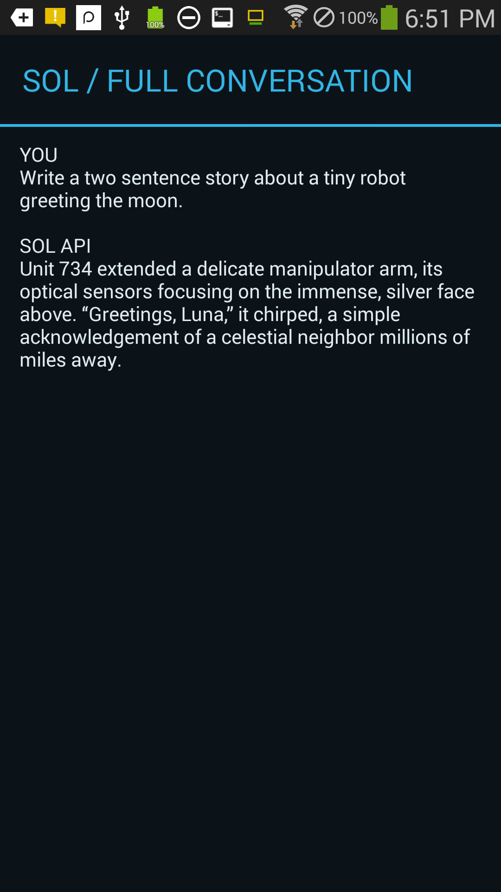
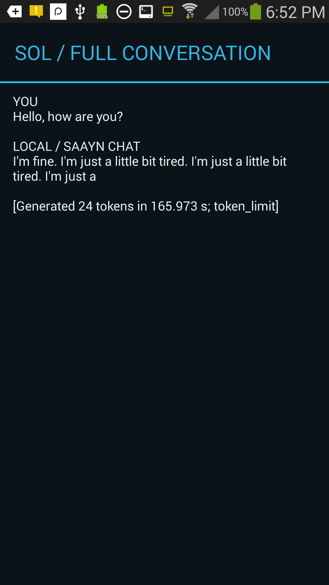

# Public endpoint and optimization validation

Date: September 21, 2026. Device: Samsung SM-S975L, Android 4.3 / API 18.

## Configuration and device upgrade

The public build now defaults to `https://sol.system42.one`, matching the existing SOL site. `SOL_API_BASE` still overrides it; an explicitly empty value builds a local-only client.

The final APK was built from this checkout with the existing private device signing identity, verified, and installed as an in-place upgrade. Existing conversations survived. No model files, phone data or SSH configuration were replaced. Noninteractive SSH was checked successfully afterward. The APK and signing key remain excluded from Git.

Tested APK SHA256: `bccbde1ddeb6b0f07169a562834dd0f78558c5af15e5d49a351054b63d499112`.

## Existing website comparison

The Android request was compared with the existing site's `chat/chat.js` and Python chat handler:

- Both use `POST /api/chat`, session identifiers, profile selection, persistence and streaming flags.
- Both understand SSE `status`, `delta`, `done` and `error` messages.
- Android intentionally requests no remote actions and no substitute fallback answer.
- The site's optional lightweight mode returns non-streaming scene narration. It was not substituted for normal Android chat.
- The browser client has no equivalent 90-second read cutoff. Server retrieval can include a second model call to formulate a supplemental search query before final generation.

No public API schema, embeddings implementation or GPT Action import was changed.

## Disconnect reproduction and client change

The earlier 90-second read / 180-second total client reproduced an EOF error while the server was preparing a reply. The server later logged a broken pipe while attempting to emit model output. This identifies a disconnected stream; it does not alone prove every EOF has the same cause.

The client now permits 240 seconds between reads and 600 seconds total, with cancellation, normal TLS verification and no automatic retries retained. A subsequent S4 request completed across roughly 107 seconds of server wall time, including about 27 seconds of final generation. This is evidence that the longer request path can complete, not a guarantee against all proxy, connectivity or cold-start failures.

The final build also snapshots saved conversation history once per request. Previously each public chunk or local token update reparsed and reformatted that unchanged history. This reduces UI-side work without changing model context, generated-token limits or transcript content; no isolated UI speedup is claimed.

## Public chat after the final APK and server update

The final APK completed this prompt through the public endpoint with `text_fast`:

> Write a two sentence story about a tiny robot greeting the moon.

The screen displayed a completed two-sentence story beginning “Unit 734 extended a delicate manipulator arm”. Server logs identified `gemma-3-4b-it-Q4_K_M.gguf` and `fallback_grounding_used: false`. Approximately 60 seconds elapsed between request-start and completion logs, including about 16 seconds of final generation.

## Full local chat on the final APK

A fresh local conversation with `Hello, how are you?` completed all 24 generated tokens in **165.973 seconds**, stopping at `token_limit`. The output matched the earlier recorded reply: “I'm fine. I'm just a little bit tired. I'm just a little bit tired. I'm just a”. This confirms full multi-token generation remains functional on the upgraded APK; it is not merely the one-token canary. The response remains repetitive and incomplete. The small timing difference from the earlier 167.798-second run is not evidence of a model-compute speedup.

## Server optimization

A bounded, five-minute supplemental-query cache was deployed to the existing server. See [patch and isolated regression check](../server-patches/README.md). Retrieval and live state are still fetched normally. Only identical model-query inputs qualify for reuse.

Two consecutive public endpoint probes used the same request and disabled final-answer caching. Both received a terminal SSE `done` event, reported `cache_hit: false` for final answers and reported no fallback substitution. The second produced a server-side `supplemental_query.cache_hit` log:

| Sample | Request-start to generation-complete logs | Final model generation |
| --- | --- | --- |
| Supplemental-query miss | 35.025 s | 12.994 s |
| Supplemental-query hit | 16.299 s | 10.716 s |

These are individual, uncontrolled live samples, not a throughput benchmark. The cache-hit log verifies skipped supplemental model work. Changing grounding inputs can correctly cause a miss, even when user wording is identical. The server keeps its SSE connection open; terminal `done`, rather than socket closure, defines completion, as the Android client already handles.

## Checks and limits

- Host manifest, SSE, dialogue-policy and native numerical parity checks passed.
- Full APK compilation and API18-compatible signature verification passed.
- Server isolated cache checks passed: exact reuse, model/profile/context separation, expiry, eviction, fallback and error behavior.
- Existing server API contract suite passed, including its fallback fixtures. Those fixtures do not imply fallback was used in the live Android tests.
- Public health endpoint returned HTTP 200 after deployment.
- `text_fast` was verified live. Other profiles, network-loss recovery and long-running soak behavior were not comprehensively retested.
